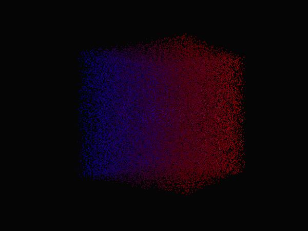

# pc3 utilities
A streamlined pc viewers and utilities for 3-arrays:
* pc3.gl tool 
* pc3.sw tool

## PC3.GL GPU
Viewer helps observing 3-arrays in real-time using GPU and fluid rendering.



### Example
```
import src.gpu.pc3 as PC3
class App(PC3):
    def __init__(super):
        pass
App.run()

```


## PC3 CPU 
Simple viewer that can display 3-array in real-time.
The input arrays are decoupled from any device and view can be rotated with mouse.

### App Usage
right mouse - rotate
left mouse - select

### Example API usage,
```
import pc3
dev = pc3.DeviceSw()
v = pc3.Viewer(dev)
v.start()

```